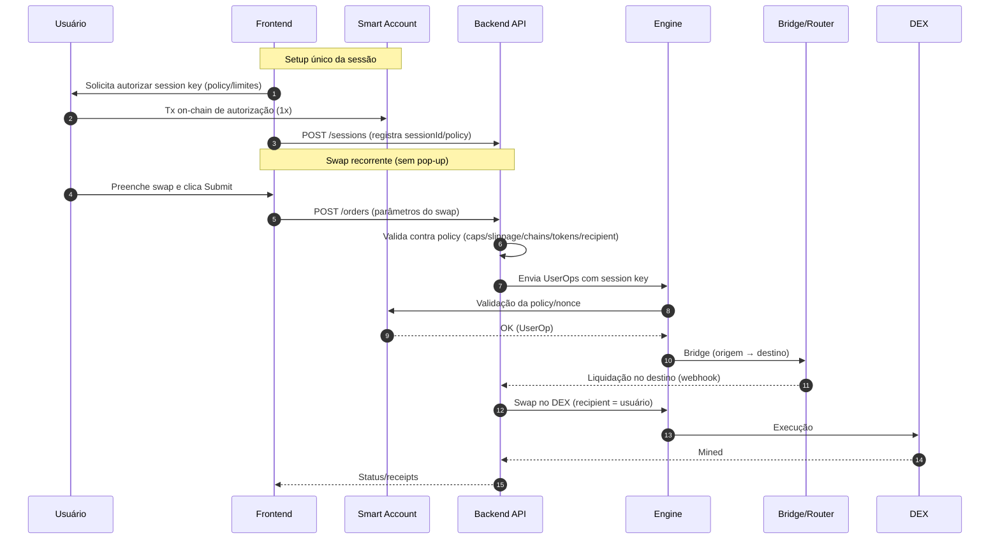

```mermaid
sequenceDiagram
  autonumber
  participant U as Usuário
  participant F as Frontend
  participant SA as Smart Account
  participant B as Backend API
  participant E as Engine
  participant BR as Bridge/Router
  participant DEX as DEX

  Note over F,SA: Setup único da sessão
  F->>U: Solicita autorizar session key (policy/limites)
  U->>SA: Tx on-chain de autorização (1x)
  F->>B: POST /sessions (registra sessionId/policy)

  Note over F,B: Swap recorrente (sem pop-up)
  U->>F: Preenche swap e clica Submit
  F->>B: POST /orders (parâmetros do swap)
  B->>B: Valida contra policy (caps/slippage/chains/tokens/recipient)
  B->>E: Envia UserOps com session key
  E->>SA: Validação da policy/nonce
  SA-->>E: OK (UserOp)
  E->>BR: Bridge (origem → destino)
  BR-->>B: Liquidação no destino (webhook)
  B->>E: Swap no DEX (recipient = usuário)
  E->>DEX: Execução
  DEX-->>B: Mined
  B-->>F: Status/receipts
```